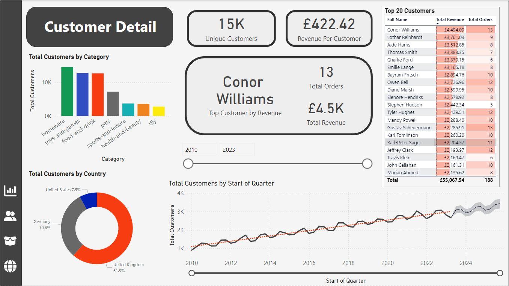
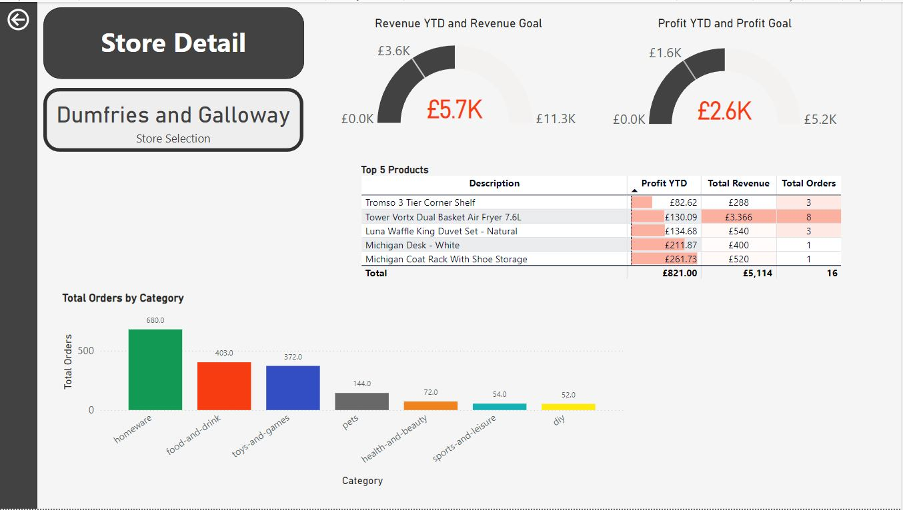
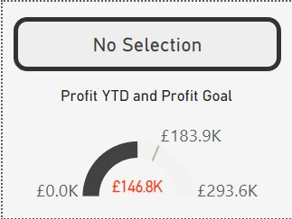
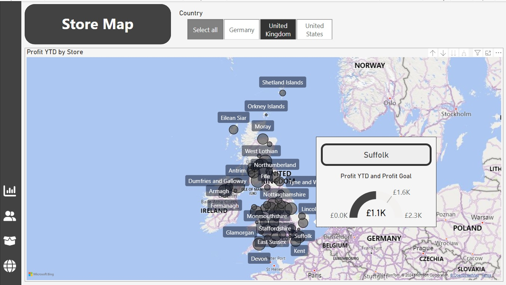

# PowerBI Report Format

This file describes the individual pages created in the Power BI pbix file. Four pages were created and named as follows

- Executive Summary
- Customer Detail
- Product Detail
- Stores Map

A theme was also selected.

## Navigation Sidebar

A sidebar was created using a rectangle shape covering a narrow strip on the left side of the page. This can be seen below, together with backgrounds for cards

## Customer Detail Page

The following elements were created to focus on customer-level analysis.

- Card visual for Total Unique Customers
- Card visual for Revenue per Customer (New measure required - [Revenue per Customer](Dax_measures.md#revenue-per-customer))
- Donut chart showing the total customers for each country using the Users[Country] column to filter the [Total Customers] measure
- Column Chart visual showing the number of customers who purchased each product category, using the Products[Category] column to filter the [Total Customers] measure. Added a trend line and a projection with 10 periods and 95% confidence
- Top 20 Customers Table displaying the top 20 customers, filtered by revenue with their full name, revenue, and number of orders.
  - When creating this table it was observed that simply using the [Full Name] field from the customers table would give an incorrect list as it was collating the revenue based on a customers name which is not unique (for example there are multiple Eleanor Williams). Therefore the [User ID] field was used as a hidden column to make the customers unique and also to drive the top 20 filter (using Top N filter type)
  - 
   

  - Added conditional formatting to the revenue column, to display data bars for the revenue values and colour highlighting of higher order numbers.
- Top Customer Cards showing the Top Customer by Revenue and the number of orders made by the customer and the total revenue generated by the customer.
  - These needed to use the same [User ID] filtering as the Top 20 Customer Table but with a Top N where N = 1.
  - Date Slicer - Added and used the [Year] column in the Date table in the 'between' style. 

Cross filtering was adjusted in the following ways by using the edit interactions view in the format tab.

- Top 20 Customers table does not filter any of the other visuals 
- Total Customers by Product Column Chart does not not affect the Customers line graph
- Total Customers by Country donut chart does cross-filter the Total Customers by Product Column Chart
  
Below is a final screenshot of the page. The layout chosen is different to the examples given as a title has been added for easy visual ID of the page that is being viewed as this report could be viewed outside of PowerBI (such as a powerpoint). The key metric cards are displayed at the tope of the page to draw the viewers attention

## Executive Summary Page

This is a report page that focuses on high level executive summary which allowed viewers to quickly get insights and outcomes on performance accross the company as a whole. The visual style of the customer detail page has been followed and elements reused where possible to keep consistency. 

The following elements have been added

-  Card Visual for Total Revenue to 2 decimal place
-  Card Visual for Total Orders to 1 decimal place
-  Card Visual for Total Profit to 2 decimal place
-  Revenue Trending Line chart with [Total Revenue} against the date hierarchy down to Month. Added a trend line and a projection with 10 periods and 95% confidence
-  Donut Chart to show [Total Revenue] by Store[Country] which details the revenue by country.
-  Donut Chart to show [Total Revenue] by Store[Store Type] which details the revenue by store type.
-  Bar Chart (horizontal) to show [Total Orders by Category] with data labels to 1 decimal place.
-  KPI Visuals to show KPIs for Quarterly Revenue, Orders and Profit
   -  For each of these a measure for the previous quarters performance was created which are documented [here](Dax_measures.md#previous-quarter-orders).
   -  Then a Target measure for each was created which was set at 105% of the performance of the previous quarter. These are documented [here](Dax_measures.md#quarterly-order-target).
   -  KPI Visual created for each with values at 1 decimal place.
   -  The Trend Axis was set to on and the following properties set
       - Direction : High is Good
       - Bad Colour : red
       - Transparency : 15%

    

On the example layout there was a table with the top 10 products and detail on revenue etc but this did not appear in the tasks for this page. On consideration of this table, I feel that it is too much detail for a high level executive summary. More detail on 10 top products will be availible on the Product Detail page which can easily be provided if that information is required.

Cross filtering was adjusted in the following ways by using the edit interactions view in the format tab.

- Product Category bar chart and Top 10 Products table do not filter the card visuals or KPIs

Below is a final screenshot of the page. Again the  layout chosen is different to the examples given as a title has been added for easy visual ID of the page that is being viewed as this report could be viewed outside of PowerBI (such as a powerpoint). The key metric cards are displayed at the tope of the page to draw the viewers attention.

## Product Detail

This is a detailed product page for the project that provides an in depth look at which products within the inventory are performing well with the option to filter by product and region. The elements on this page are as follows

- 3 Gauges showing current-quarter performance of Orders, Revenue and Profit against a quarterly target (110% of previous quarter performance)
  - 3 new measures were created for the current quarter performance
    -  [Current Quarter Orders](Dax_measures.md#current-quarter-orders)
    -  [Current Quarter Profit](Dax_measures.md#current-quarter-profit)
    -  [Current Qaurter Revenue](Dax_measures.md#current-quarter-revenue)
  - 3 new measures were created for the 10% targets based on the previous quarter performance as below 
    - [Quarterly Order Target 10%](Dax_measures.md#quarterly-order-target-10)
    - [Quarterly Profit Target 10%](Dax_measures.md#quarterly-profit-target-10) 
    - [Quarterly Revenue Target 10%](Dax_measures.md#quarterly-revenue-target-10)
  - However, when these target measure were used, they did not display any data. Further investigation determined this was because the underlying "previous quarter" measures were using PREVIOUSQUARTER and as the data only goes to mid 2023, there is no data in the previous quarter from the current date. The following measures were modified to select the previous quarter based on the max date in the date table.
    - [Previous Quarter Orders](Dax_measures.md#previous-quarter-orders)
    - [Previous Quarter Profit](Dax_measures.md#previous-quarter-profit)
    - [Previous Quarter Revenue](Dax_measures.md#previous-quarter-revenue)
  - 3 new measures for the gap between target and the current month
  - Max value was set the target level so the guage shows as full when the target is met
  - Conditional formatting was applied to the callout value, using the gap measures to highlight the text in red if below target and black otherwise.
 
    
- 2 Filter state cards to show the status of the filters that will be applied via slicers with a measure for [category](Dax_measures.md#category-selection) and one for [country](Dax_measures#country-selection)
- An area chart showing the different product categories performance in revenue over time. 
  - x axis = Dates{Start of Quarter]
  - Y axus = [Total Revenue]
  - Legend = Products[Category]
- A top 10 products table (using the table on the customer detail page as a base) with the following colums
  - Product description
  - Total Revenue
  - Total Customers
  - Total Orders
  - Profit per Order (this was a new [measure](Dax_measures.md#profit-per-order))
- Scatter Graph to show which products are both high selling and high profit. 
  - New calculated column called [Profit per Item] in the products table was created (detailed [here](Dax_tables_columns.md#profit-per-item))
  - Values  =  Products[Description]
  - X Axis =  Prducts[Profit per item]
  - Y Axis = [Total Orders]
  - Legend = Products[Category]
- A slicer toolbar was created to allow the selection of categories and countries to analyse but without cluttering the main page. 
  - A filter button was added to the nav bar and a rectangle shape to the page to contain the filters
  - Two slicers were added 
    - Category Slicer set to Products[Category] with multi item selection
    - Country Slicer set to Stores[Country] with a Select All opion
  - Added a back button to the rectangle
  - Created two bookmarks (one with the slicer toolbar showing and one without) and assigned as actions to the two buttons to allow the toolbar to be shown and hidden by the user.
  
    

Cross filtering was adjusted in the following ways by using the edit interactions view in the format tab.

- Orders vs. Profitability scatter graph does not affect any other visuals 
- Top 10 Products table does not affect any other visuals

Below is a final screenshot of the page. Again the layout chosen is different to the examples given as a title has been added for easy visual ID of the page that is being viewed as this report could be viewed outside of PowerBI (such as a powerpoint). The key metric gauges are displayed at the tope of the page to draw the viewers attention.

## Store Map

This is a report page that allows regional managers to interact with a map of their respective geographic regions, see the higher profit stores and drill through to more detail, as well as using a slicer to select particular countries. The elements on the page include 

- A map visual which takes up most of the page with the Geography hierarchy added to the Location field and the [Profit YTD] measure added to the bubble size so that all the stores are mapped and the bubble size scales with the profit. Map settings should be as follows
  - Auto-zoom = On
  - Zoom Buttons = Off
  - Lasso Button = Off
  - Show labels - On
- A country slider was added with the field set to Stores[Country] field with the style of the slicer as a tile and multselect and select all as active options

Below is a final screenshot of the page. A title has been added for easy visual ID of the page that is being viewed as this report could be viewed outside of PowerBI (such as a powerpoint).

## Stores Drillthrough

To allow a regional manager to drill through from the map page to view more detail about a particular store, a Store DrillThrough page has been created.

To ensure this page works as a drill through the following settings were set in the Page Information tab.

 

The following visuals were added to the drill-through page

- A table containing the top 5 products with description, Profit YTD, Total Orders and Total Revenue measures. A Top N = 5 filter was applied to the description based on the Profit YTD. This is used as the focus of the drill down is the YTD profit and also if the total revenue is used then often the Profit YTD column is blank because the product has not been ordered in the time period.
- A column chart showing total orders against product category.
- Gauges were added for 
  - Profit YTD against the Profit Goal which is a new measure which is a 20% increase in the previous years profit. See measure details [here](Dax_measures.md#profit-goal).
  - Revenue YTD against the Revenue Goal which is a new measure which is a 20% increase in the previous years profit. See measure details [here](Dax_measures.md#revenue-goal).

Below is a final screenshot of the page. A title has been added for easy visual ID of the page that is being viewed as this report could be viewed outside of PowerBI (such as a powerpoint). A card has also been added to show the store location that is being viewed. The measure on the card is detailed [here](Dax_measures.md#store-selection).
  

## Stores Tooltip

An custom tooltip page was created to allow the user to quickly see the YTD profile performance of a store by hoving over it. The page was created and the page information set as below and the canvas type set to 'tooltip'

The page is shown below with the profit gauge copied from the Stores Drill through and the location card as a title.

This is how it looks as a hover on the Store Map

## Navigation Bar

The navigation bar is built using 4 sets of two different coloured icons. Four new blank buttons were added and the default of each (Format > Button Style) was set to the white coloured icon. To change the colour when the button was hovered over, each On Hover (Format > Button Style > Apply settings to and set it to On Hover) has the blue icons set. Then each button has the Action turned on with page navigation and the correct page selected under Destination.

This looks as below

These were copied to the main pages and the filter icon on the Product Detail page was also modifed to include the hover colour change.

