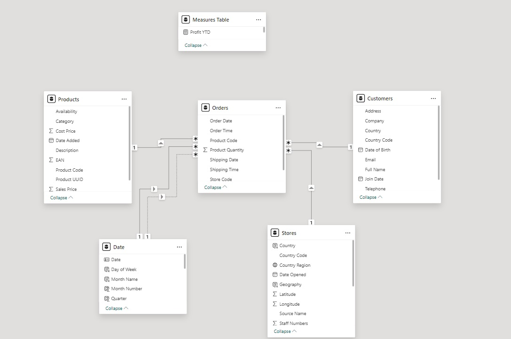

# Star Schema Data Model

The Star Schema Data Model for the Power Bi Project is defined as below

- Products[product_code] to Orders[product_code]
- Stores[store code] to Orders[Store Code]
- Customers[User UUID] to Orders[User ID]
- Date[date] to Orders[Order Date]  - this needs to be the active relationship
- Date[date] to Orders[Shipping Date]

The Orders Table is the Fact table and all relationships are one-to-many, with a single filter direction flowing from the dimension table side to the fact table side.

A measures table to hold DAX measures was also created.

Below is an image of the schema

